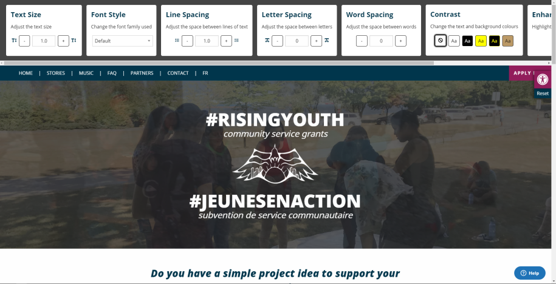

# a11ize



A React-based accessibility toolkit to make any website accessible.
a11ize is fast, extensible, and most importantly, lightweight (21.55 kb gzipped without core-js).

Check out a live demo at [https://risingyouth.ca](https://risingyouth.ca).

## Features

- Text Sizing
- Font Style
  - Bundles Open Dyslexic by default
- Line Spacing
- Word Spacing
- Custom high-contrast colour filters
- Enhanced Inputs
- Table of Contents
  - Dynamically generated from semantic HTML
- i18n Support (PRs welcomed!)

## Usage notes

- Ensure that text sizes are defined in `rem`s

### React usage

Wrap the content you want to be modified by a11ize in the `AccessibilityButton`
tag.

```jsx
  import A11yWrapper from 'a11ize';
  ...
  <A11yWrapper {...options}>
    Site content here.
  </A11yWrapper>
```

### Non-React usage

Add the id of `accessible-content` to an element so that it wraps the content you want a11ize to affect (generally the entire page).

```html
<div id="accessible-content">
  Site content here.
</div>
<script src="https://cdn.jsdelivr.net/npm/@takingitglobal/a11ize@1/dist/with-react/index.js">
```

For wider browser compability, use the version with CoreJS bundled in.

```html
<div id="accessible-content">
  Site content here.
</div>
<script src="https://cdn.jsdelivr.net/npm/@takingitglobal/a11ize@1/dist/with-react-cjs/index.js">
```

## Font Usage

a11ize bundles the Open Dyslexic font face by default. Please make sure to
abide by their licensing rules if you choose to use Open Dyslexic in your own
projects.

## Contributing

### Translations & i18n

If you're able to translate the text in a11ize to another language, please make a PR with the new YAML file of translations.
Example YAML files are in `src/i18n/en.yml`. The translated text should match to the appropriate key, with the language code as the filename.

## To-do

- [ ] Write tests (Help needed!)
- [ ] Add CSS color parameters
